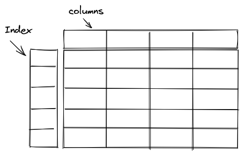

# Pandas
Pandas has two primary data structures  
1. DataFrame
2. Series

DataFrame is a two dimensional data structure which has rows and columns.  

Series is a one dimensional data structure which has homogeneous data. 



In DataFrame or Series, each row can have a label. These labels are call Index. Pandas generates default index for rows which is a numerical sequence.
You could access a row by its label.
```python
>>> import pandas as pd
>>> movies = pd.read_csv("movies.csv")
>>> movies.head()

   Rank                         Title       Studio       Gross  Year
0     1             Avengers: Endgame  Buena Vista  $2,796.30   2019
1     2                        Avatar          Fox  $2,789.70   2009
2     3                       Titanic    Paramount  $2,187.50   1997
3     4  Star Wars: The Force Awakens  Buena Vista  $2,068.20   2015
4     5        Avengers: Infinity War  Buena Vista  $2,048.40   2018
```

In the above example, since there is no index column specified, pandas created default index which is a number sequence (0, 1, 2, 3...)  

We can also specify the index column while reading the csv file 
```python
>>> movies = pd.read_csv("movies.csv", index_col='Title')
>>> movies.head()
                              Rank           Studio       Gross  Year
Title
Avengers: Endgame                1      Buena Vista  $2,796.30   2019
Avatar                           2              Fox  $2,789.70   2009
Titanic                          3        Paramount  $2,187.50   1997
Star Wars: The Force Awakens     4      Buena Vista  $2,068.20   2015
Avengers: Infinity War           5      Buena Vista  $2,048.40   2018
```

## Accessing a row by index
You could access a row using its label, either default labels which are generated by pandas or the one that you provided.
If index does not have duplicates, then it returns a single record which is of Series type.
```python
>>> movies.iloc[0]
Rank                1
Studio    Buena Vista
Gross      $2,796.30
Year             2019
Name: Avengers: Endgame, dtype: object

>>> movies.loc['Avengers: Endgame']
Rank                1
Studio    Buena Vista
Gross      $2,796.30
Year             2019
Name: Avengers: Endgame, dtype: object
```

Pandas allows index to have deplicate values i.e. more than one rows can have the same label. In that case, when we fetch the data from dataframe using label,
we get multiple rows which is data frame.
```python
>>> movies = pd.read_csv("movies.csv",index_col='Studio')
>>> movies.loc['Buena Vista'].head()
             Rank                         Title       Gross  Year
Studio
Buena Vista     1             Avengers: Endgame  $2,796.30   2019
Buena Vista     4  Star Wars: The Force Awakens  $2,068.20   2015
Buena Vista     5        Avengers: Infinity War  $2,048.40   2018
Buena Vista     7         Marvel's The Avengers  $1,518.80   2012
Buena Vista     9       Avengers: Age of Ultron  $1,405.40   2015
```
